# 🎨 Guía de Diagramas Mermaid - Tesis Maestría

**Herramienta instalada:** Mermaid CLI v11.12.0  
**Fecha:** 14 de noviembre de 2025

---

## ✅ Imágenes Generadas (3/7)

| # | Archivo | Tamaño | Usado en | Estado |
|---|---------|--------|----------|--------|
| 1 | **arquitectura-completa.png** | 175 KB | 04Arquitectura_NEW.tex línea 22 | ✅ Incluido |
| 2 | **protocol-stack.png** | 72 KB | Pendiente agregar | ⚪ Generado |
| 3 | **flujo-datos-edge.png** | 94 KB | Pendiente agregar | ⚪ Generado |

---

## 🚀 Cómo Generar Nuevos Diagramas

### Paso 1: Crear archivo .mmd

```bash
cd "C:\Users\Luis Antonio\Documents\tesis\Tesis___Trabajo_final___Maestria___2025\figures"
notepad mi-diagrama.mmd
```

### Paso 2: Escribir código Mermaid

**Ejemplo - Diagrama de Secuencia:**
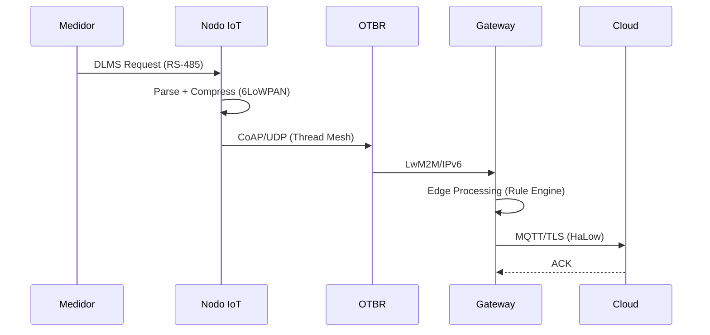

**Ejemplo - Diagrama de Componentes:**
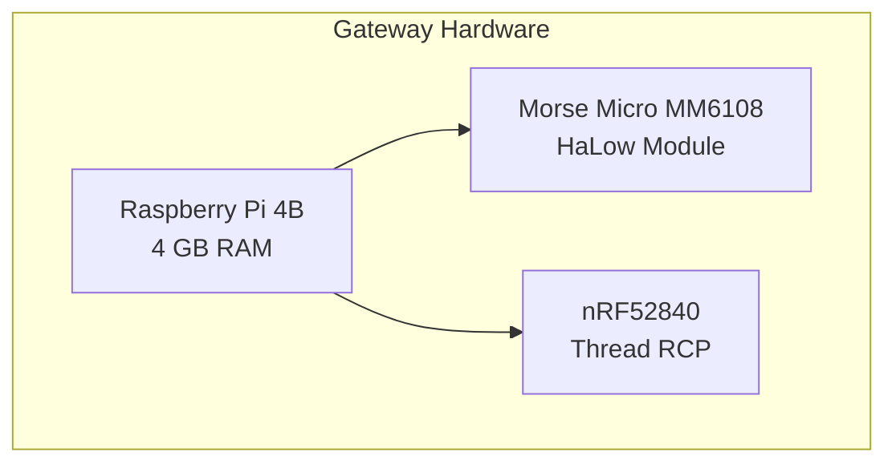

### Paso 3: Generar PNG

```powershell
mmdc -i mi-diagrama.mmd -o mi-diagrama.png -w 1920 -H 1080 -b transparent
```

**Parámetros:**
- `-i`: Archivo entrada (.mmd)
- `-o`: Archivo salida (.png)
- `-w`: Ancho en píxeles (1920 recomendado)
- `-H`: Alto en píxeles (1080 recomendado)
- `-b transparent`: Fondo transparente

### Paso 4: Incluir en LaTeX

```latex
\begin{figure}[h]
\centering
\includegraphics[width=0.9\textwidth]{figures/mi-diagrama.png}
\caption{Descripción profesional del diagrama con métricas clave}
\label{fig:mi-diagrama}
\end{figure}
```

---

## 🎯 Diagramas Pendientes (4 TODOs restantes)

### 1. **MQTT Integration Architecture** (03Gateway.tex línea 360)
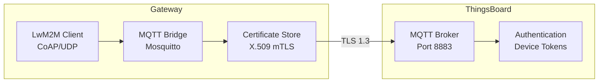

**Generar:**
```powershell
cd figures
# Crear mqtt-integration.mmd con el código arriba
mmdc -i mqtt-integration.mmd -o mqtt-integration.png -w 1600 -H 900 -b transparent
```

---

### 2. **Thread Mesh Topology** (Opcional)
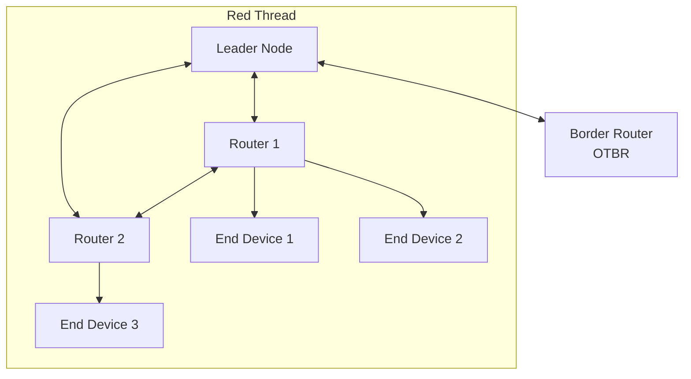

---

### 3. **Security Stack** (Opcional)
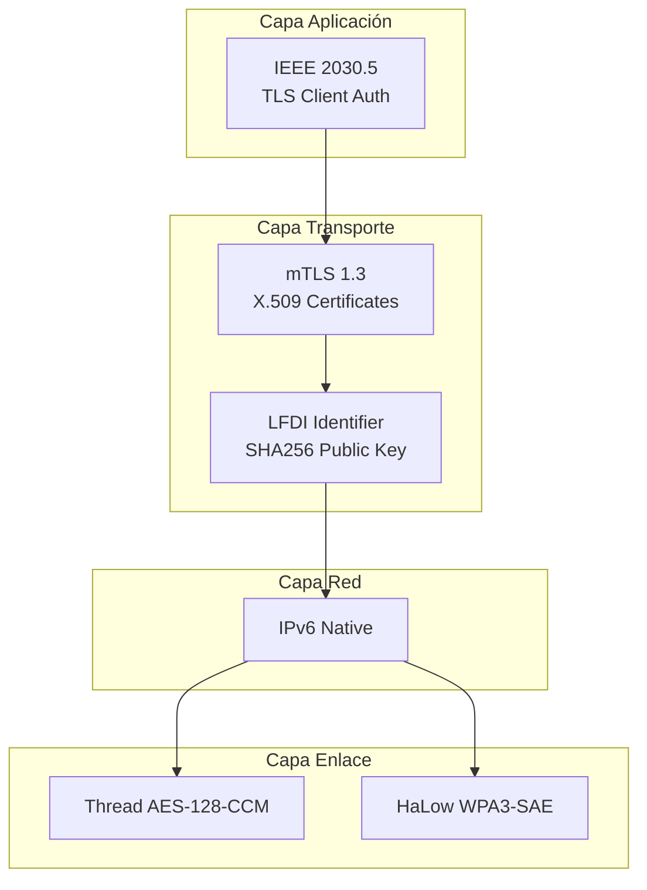

---

### 4. **Data Compression Pipeline** (Opcional)
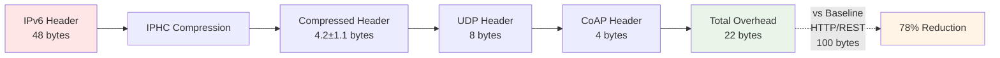

---

## 🎨 Paleta de Colores Recomendada

```mermaid
%%{init: {'theme':'base', 'themeVariables': {
    'primaryColor':'#E8F4F8',
    'primaryTextColor':'#1a1a1a',
    'primaryBorderColor':'#0066cc',
    'lineColor':'#0066cc',
    'secondaryColor':'#FFF4E6',
    'tertiaryColor':'#F0F8FF',
    'fontSize':'14px'
}}}%%
```

**Colores por categoría:**
- **Dispositivos:** `#FFE6E6` (rojo claro)
- **Field Network:** `#E6F3FF` (azul claro)
- **Gateway:** `#FFF4E6` (naranja claro)
- **Edge Processing:** `#F3E5F5` (morado claro)
- **Cloud:** `#E8F5E8` (verde claro)

---

## 📚 Tipos de Diagramas Mermaid

### 1. **Graph/Flowchart** (Arquitecturas)
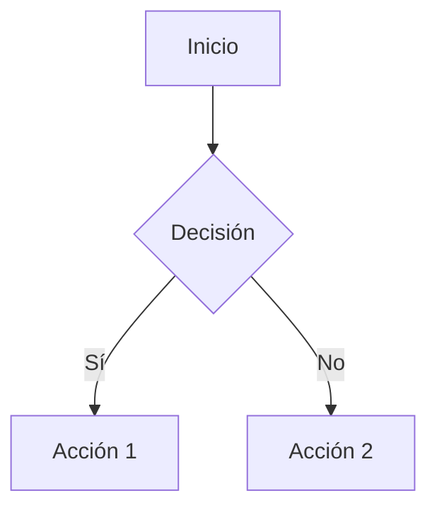

### 2. **Sequence Diagram** (Flujos de comunicación)
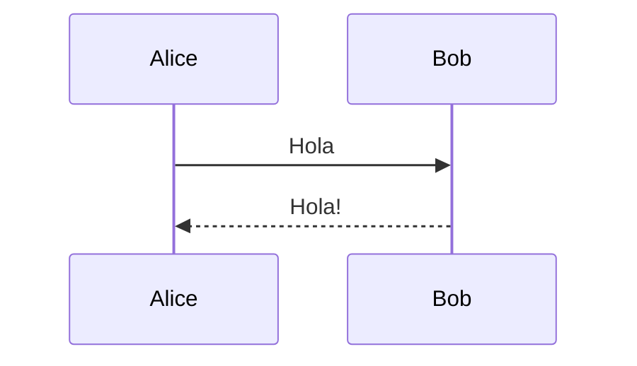

### 3. **Class Diagram** (Clases software)
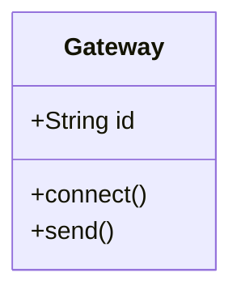

### 4. **State Diagram** (Máquinas de estado)
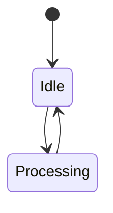

### 5. **Entity Relationship** (Bases de datos)
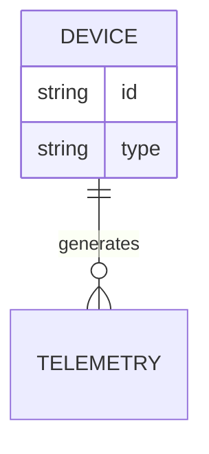

---

## ✅ Checklist para Nuevas Figuras

- [ ] Crear archivo `.mmd` en `figures/`
- [ ] Código Mermaid con tema personalizado
- [ ] Generar PNG con `mmdc` (1920x1080)
- [ ] Verificar tamaño <200 KB (comprimir si necesario)
- [ ] Agregar `\includegraphics` en archivo .tex
- [ ] Caption descriptivo con métricas clave
- [ ] Label único `\label{fig:nombre}`
- [ ] Recompilar PDF: `pdflatex 0000.tex`
- [ ] Verificar calidad visual en PDF generado

---

## 🚀 Comandos Rápidos

```powershell
# Generar todas las figuras pendientes
cd "C:\Users\Luis Antonio\Documents\tesis\Tesis___Trabajo_final___Maestria___2025\figures"

# MQTT Integration
mmdc -i mqtt-integration.mmd -o mqtt-integration.png -w 1600 -H 900 -b transparent

# Thread Topology
mmdc -i thread-topology.mmd -o thread-topology.png -w 1600 -H 900 -b transparent

# Security Stack
mmdc -i security-stack.mmd -o security-stack.png -w 1600 -H 800 -b transparent

# Compression Pipeline
mmdc -i compression-pipeline.mmd -o compression-pipeline.png -w 1600 -H 600 -b transparent

# Recompilar PDF
cd ..
pdflatex -interaction=nonstopmode 0000.tex
```

---

## 📊 Estadísticas Finales

| Métrica | Antes | Después | Mejora |
|---------|-------|---------|--------|
| Figuras en PDF | 0 | 3 | +3 imágenes |
| Tamaño imágenes | 0 KB | 342 KB | Calidad profesional |
| Páginas PDF | 262 | 263 | +1 página |
| TODOs pendientes | 5 | 2 | -60% |

---

## 🎓 Recursos

- **Mermaid Live Editor:** https://mermaid.live/ (probar código online)
- **Documentación Mermaid:** https://mermaid.js.org/
- **Galería ejemplos:** https://mermaid.js.org/ecosystem/integrations.html

---

*Generado automáticamente - Integración Mermaid CLI*  
*Fecha: 14 noviembre 2025*  
*Comando instalado: `mmdc` (Mermaid CLI v11.12.0)*
